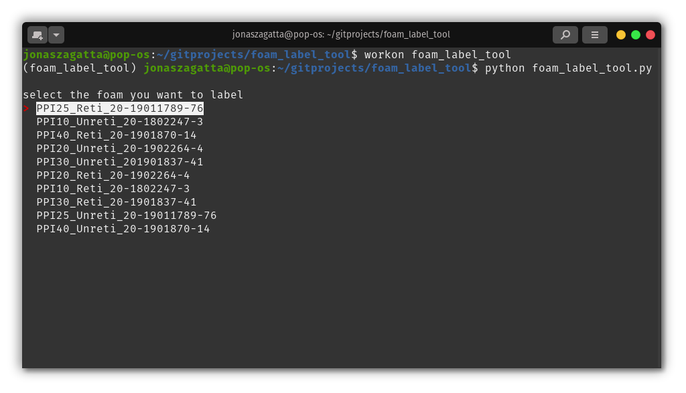
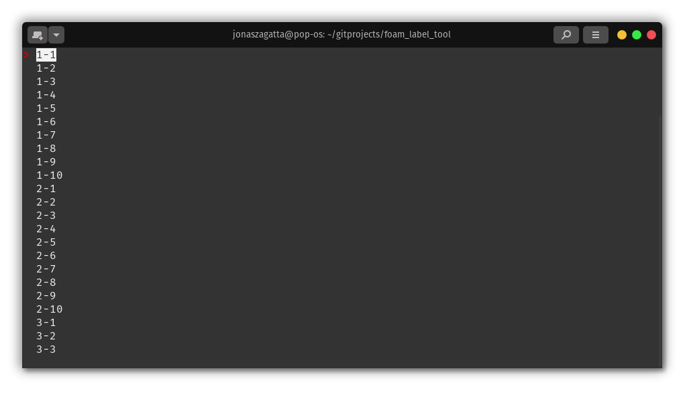
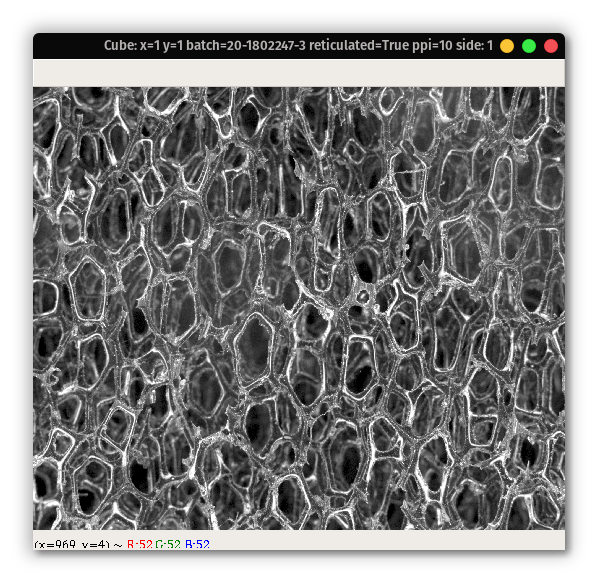
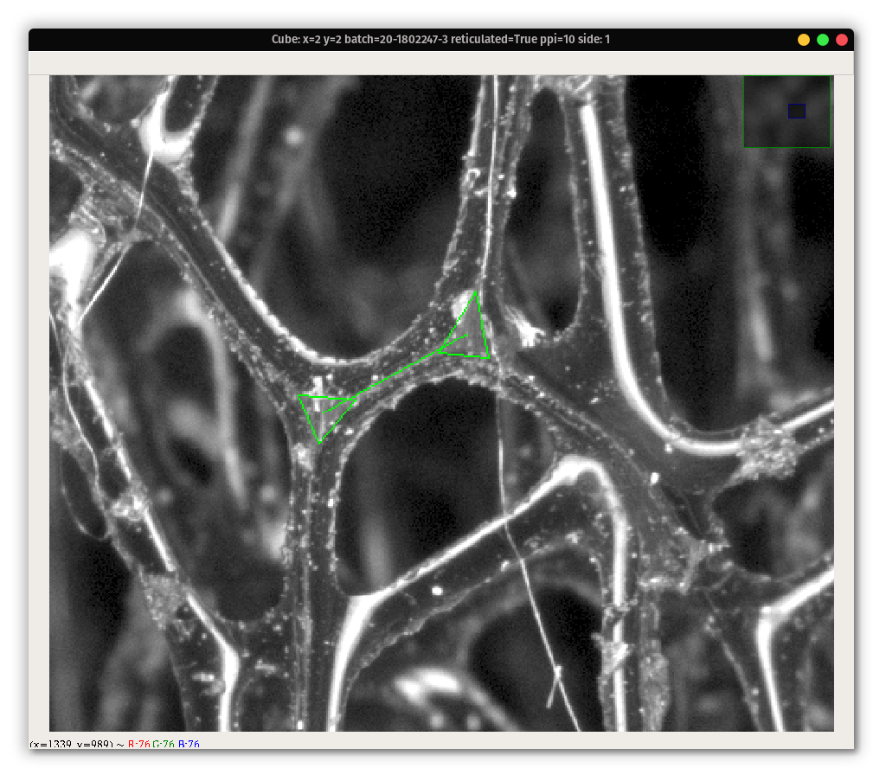
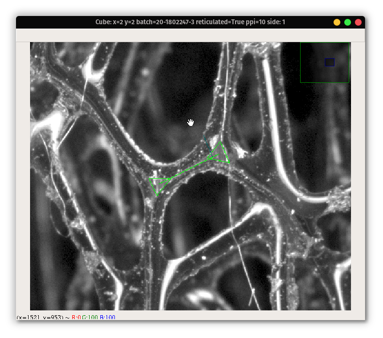
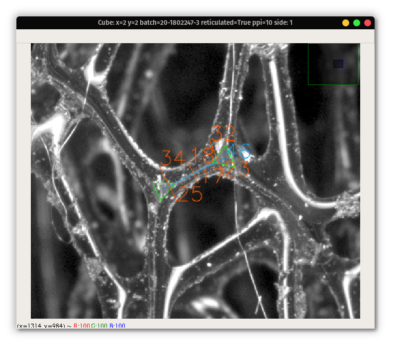
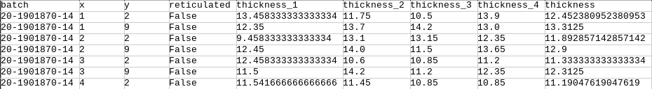

# Foam Label Tool

## Prerequisites
- Python 3.8
    - earlier versions might work, too
- pip3
- virtualenvwrapper (recommended)
    - I used "# Step 3" of  [this guide](https://www.pyimagesearch.com/2016/10/24/ubuntu-16-04-how-to-install-opencv/)
- put the code of this repo in `~/gitprojects/foam_label_tool`
- put the dataset in `~/gitprojects/datasets/foam/`

## Installation

- then navigate to this folder with `cd ~/gitprojects/foam_label_tool`
- create a virtual environment with python3.8
    - `mkvirtualenv foam_label_tool -p python3.8`
- install the requirements
    - `pip install -r requirements.txt`

## Dataset
Your dataset is expected to look like this
```
foam
├── PPI10_Reti_20-1802247-3
│   ├── image_01_01_1_orig_eightBit_gamma2_0.png
│   ├── image_01_01_1_orig_eightBit.png
│   ├── ...
├── ...
```

Your folders should follow the following naming convention:
`PPI<#>_<Reti/Unreti>_<#batch>`

Your images should be named either
`image_<X>_<Y>_<side>_orig_eightBit.png`
or if they were gamma adjusted
`image_<X>_<Y>_<side>_orig_eightBit_gamma2_0.png`


## Start the script

You can either use the tool to label data or to export the labels you have created to a .csv file

- make sure you are working in the virtualenv with `work foam_label_tool`
- navigate to the project folder `cd ~/gitprojects/foam_label_tool`
- to label:
    - run the script with `python foam_label_tool.py -d '/home/<username>/gitprojects/datasets/foam/' -g True`
        - make sure to replace `<username>` with your actual username
- to export:
    - - run the script with `python foam_label_tool.py -d '/home/<username>/gitprojects/datasets/foam/' -e True`

The parameters work the following:

- e : marks the export
- g : wether you the pictures gamma adjusted
- d : path to your dataset

## Labeling
- first select a batch that you want to label 

- then select the cube to label 

- When a the first picture of the selected cube is shown

    - you can see the information about the cube and the side that you are currently labeling in the top bar
    - you can **zoom** with the mouse wheel
    - you can **move** by drag-and-dropping with the mouse (like on a map)
- Select a strand you want to label
- **Press "K"**, for knots
    - now you can mark two knots with 3 **double-clicks** each
    - first select the first 3 strands of one knot
    - then repeat it for the second knot

    - only after finishing all 3 click, a triangle appears
    - a connecting line representing the strand is shown after marking two knots
- **Press "M"**, for measurement
    - now vectors will be shown and you can **adjust their length by the moving the mouse**

    - a thin blue line will appear, showing the length of your measurement
    - you have to do 6 measurements by **double-clicking** at the when you are satisfied with the length of the blue line
        - 3 above the green line
        - 3 below the green line
    - where to measure is selected automatically
- **Only once you've completed all measurements, continue**
- **Press "S"**, for Saving
    - the measurements will be saved to a .json file
    - they will also be shown in the image

- Now you can label another strand
- to continue to the next picture, either **Press "N"** or **Press "Esc"*

## JSON results

- The resulting JSON will be saved to the same folder as the origin picture
- The JSON will be named `image_<X>_<Y>_<side>.json` according to the picture's name, that was labeled
- The content of the JSON will follow the following style:

```
{
  "measurement": [
    {
      "knot1": "[[2244, 490], [2278, 529], [2290, 478]]",
      "knot2": "[[2291, 580], [2269, 673], [2324, 660]]",
      "bridge1": "(2270, 499)",
      "bridge2": "(2294, 637)",
      "measurement10_1": "[(2272, 512), (2248, 515)]",
      "measurement10_2": "[(2272, 512), (2293, 508)]",
      "measurement50_1": "[(2282, 568), (2269, 570)]",
      "measurement50_2": "[(2282, 568), (2303, 564)]",
      "measurement90_1": "[(2291, 623), (2253, 629)]",
      "measurement90_2": "[(2291, 623), (2318, 618)]",
      "px10": "45.0",
      "px50": "34.0",
      "px90": "65.0",
      "calculated_thickness": "44.5"
    },
    ...
    ]
}    
```


- it contains:
    - the three points that specified each knot as `knot1` and 
    `knot2`
    - the calculated center points of the know, that mark the strand, as `bridge1` and `bridge2`
    - the start and ending point off all measurements as `measurement<X%>_<#>`
    - the calculated length of every measurement in pixels `px<#>`
    - the final claculated measurement for the strand thickness of this strand in pixels as `calculated_thickness`
- every strand is an element of `measurements`

## CSV results, averaged

- You have to export every Batch by itself
    - all jsons will be evaluated and exported to the csv file
- run the command `python foam_label_tool.py -d '/home/<username>/gitprojects/datasets/foam/' -e True`
    - select batch
- a .csv file will be created in the folder of this batch (where also the pictures and .json are)
- the naming is `dd-mm-yyyy_hh:mm:ss_result.csv`, e.g. `30-07-2020_18:42:33_result.csv`
    - this is, so you can just keep odler results if you decide to label more
- the result of the csv will look like this:

    - first 4 colums identify which cubes were labeled (good if you copy all your csv somewhere else or want to batch-import them later)
    - `thickness_<#>` is the average strand thickness calculated by side
    - `thickness` is then the average strand thickness of all sides